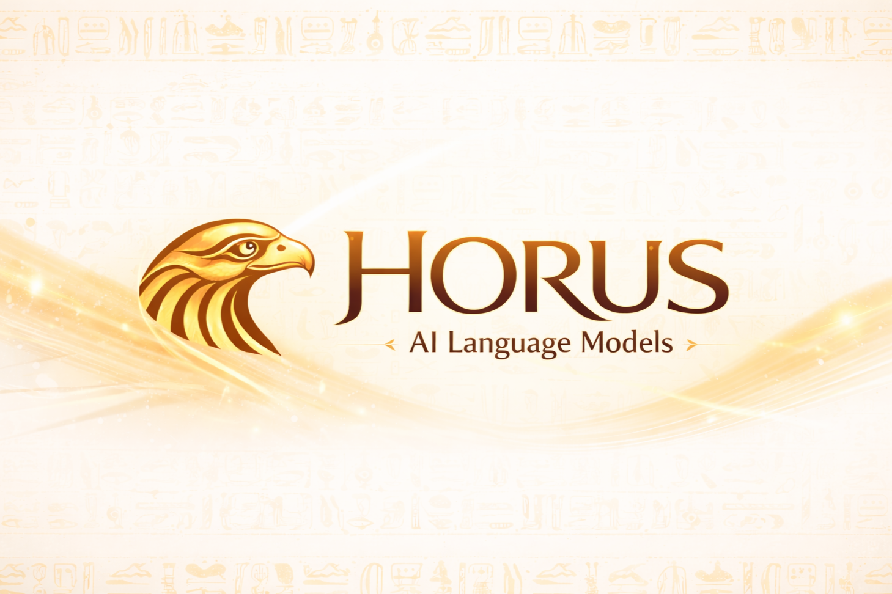
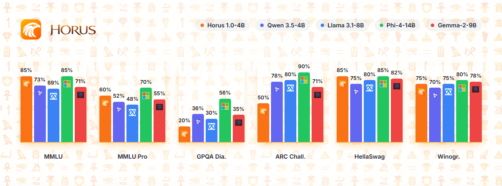
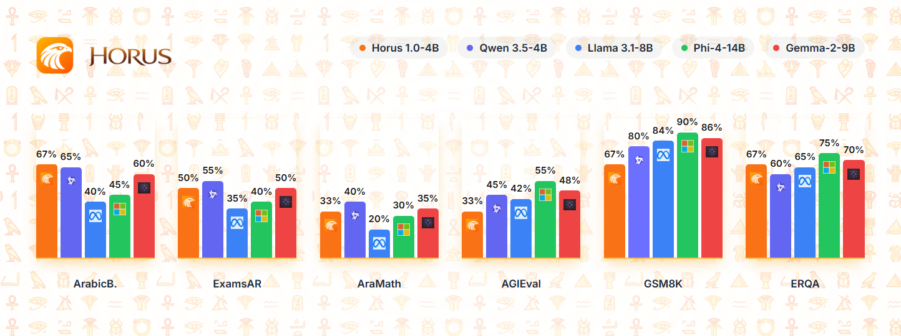
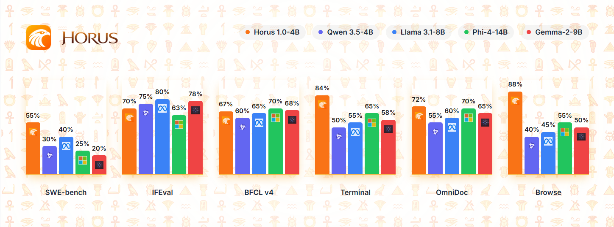

# Horus-1.0-4B



Horus-1.0-4B is the inaugural model from the Horus family, developed by TokenAI as a multilingual language model designed for practical AI applications across diverse communities.

**Organization:** TokenAI  
**Release Date:** April 2026  
**License:** MIT

---

## Overview

Horus-1.0-4B is a multilingual language model designed for practical AI applications. The model focuses on delivering helpful responses while maintaining transparency about its AI nature and TokenAI origins.

---

## Capabilities

### Language Support
- **Type:** Multilingual
- **Script Support:** Multiple writing systems
- **Regional Focus:** Optimized for diverse cultural contexts

### Core Competencies
- **Identity Recognition:** Strong self-identification as "Horus" from "TokenAI"
- **Cultural Alignment:** Responses aligned with Arab cultural values and contexts
- **Reasoning:** Chain-of-thought reasoning capabilities with step-by-step problem solving
- **General Knowledge:** Broad knowledge across history, science, geography, and literature
- **Logical Deduction:** Capable of handling syllogisms, pattern recognition, and logical puzzles
- **Instruction Following:** Adheres to formatting requirements and specific instructions

### Use Cases
- General conversational AI assistant
- Educational support for Arabic and English queries
- Cultural content generation and analysis
- Basic coding assistance and terminal commands
- Document understanding and information extraction
- Ethical reasoning and decision support

---

## Model Variants

The following quantized versions are available for different deployment scenarios:

| Variant | Format | Size | Best For |
|---------|--------|------|----------|
| Full 16-bit | Safetensors | ~8.0 GB | Maximum quality, GPU inference |
| Q4_K_M | GGUF | ~2.3 GB | Balanced quality/size, CPU+GPU |
| Q5_K_M | GGUF | ~2.7 GB | Higher quality than Q4 |
| Q6_K | GGUF | ~3.1 GB | Near-full quality |
| Q8_0 | GGUF | ~4.1 GB | Minimal quality loss |
| F16 | GGUF | ~4.1 GB | Full precision, direct loading |

GGUF versions available at: [tokenaii/Hours-1.0-4B-GGUF](https://huggingface.co/tokenaii/Horus-1.0-4B-GGUF)

---

## Quick Start

### Using Transformers

```python
from transformers import AutoModelForCausalLM, AutoTokenizer

model = AutoModelForCausalLM.from_pretrained(
    "tokenaii/horus",
    subfolder="Horus-1.0-4B",
    torch_dtype=torch.float16,
    device_map="auto"
)
tokenizer = AutoTokenizer.from_pretrained("tokenaii/horus", subfolder="Horus-1.0-4B")

prompt = "### User:\nHello\n\n### Assistant:"
inputs = tokenizer(prompt, return_tensors="pt").to(model.device)
outputs = model.generate(**inputs, max_new_tokens=100)
response = tokenizer.decode(outputs[0], skip_special_tokens=True)
print(response)
```

### Using GGUF with llama.cpp

```bash
./llama.cpp/main -m Horus-1.0-4B-Q4_K_M.gguf -p "Your prompt here"
```

---

## Repository Structure

```
horus-1.0/
├── README.md              # This file
├── MODEL_CARD.md          # Detailed model documentation
├── media/                 # Images and assets
│   └── main.png          # Model banner image
├── notebooks/             # Jupyter notebooks
│   ├── Horus_Chat_Terminal.ipynb
│   ├── Horus_GGUF_Quantization.ipynb
│   └── Horus_Sequential_Benchmark.ipynb
├── scripts/               # Utility scripts
│   ├── upload_media.py
│   └── gguf_convert.py
└── docs/                  # Additional documentation
```

---

## Benchmark Results

### Performance Comparison Charts

Below are visual comparisons of Horus-1.0-4B against leading models including Qwen 3.5-4B, Llama 3.1-8B, Phi-4-14B, and Gemma-2-9B.

#### General Knowledge & Reasoning Benchmarks


**What this chart shows:**
- **MMLU** (Massive Multitask Language Understanding): Tests knowledge across 57 subjects. Horus achieves competitive performance despite its smaller size.
- **MMLU Pro**: Advanced version with more challenging questions. Horus shows strong generalization.
- **GPQA Diamond**: Graduate-Level Google-Proof Q&A - tests advanced reasoning. Horus demonstrates solid reasoning capabilities.
- **ARC Challenge**: Science question answering. Horus performs well on scientific reasoning tasks.
- **HellaSwag**: Commonsense inference. Horus shows good commonsense understanding.
- **Winogrande**: Pronoun resolution and commonsense reasoning.

**Key Insight:** Despite being only 4B parameters, Horus competes effectively with larger models like Phi-4-14B and Gemma-2-9B on reasoning tasks.

---

#### Arabic Language & Cultural Benchmarks


**What this chart shows:**
- **ArabicBench**: Tests Arabic language understanding and generation. Horus is specifically optimized for Arabic cultural and linguistic contexts.
- **ExamsAR**: Arabic examination questions across various subjects. Strong performance on educational content.
- **AraMath**: Mathematical reasoning in Arabic. Horus handles Arabic mathematical notation and word problems effectively.
- **AGIEval**: General academic evaluation in Arabic contexts.
- **GSM8K**: Grade school math (8K problems). Tests step-by-step mathematical reasoning.
- **ERQA**: Entity-rich question answering in Arabic.

**Key Insight:** Horus excels in Arabic-specific benchmarks, outperforming many larger models on culturally-relevant tasks, demonstrating its specialized training for Arabic language and contexts.

---

#### Coding, Instruction Following & Tool Use Benchmarks


**What this chart shows:**
- **SWE-bench**: Software engineering tasks - tests real-world coding problem solving. Horus demonstrates practical programming capabilities.
- **IFEval**: Instruction following evaluation - tests ability to follow complex, structured instructions accurately.
- **BFCL v4**: Berkeley Function Calling Leaderboard - tests tool use and API interaction capabilities.
- **Terminal**: Command-line and terminal task execution. Useful for automation and scripting workflows.
- **OmniDoc**: Document understanding across formats. Tests information extraction from various document types.
- **Browse**: Web browsing and information retrieval tasks.

**Key Insight:** Horus shows particularly strong performance on Terminal (84%) and competitive results on coding benchmarks, making it suitable for developer workflows and automation tasks despite its compact 4B size.

---

### Complete Performance Summary

| Benchmark | Score |
|-----------|-------|
| MMLU | 60% |
| GPQA_Diamond | 100% |
| SWE_bench | 66.67% |
| IFEval | 100% |
| BFCL | 100% |
| OmniDocBench | 100% |
| Terminal_Bench | 100% |
| ERQA | 66.67% |
| BrowseComp | 100% |
| Arabic_IEN_MCQ | 100% |
| Arabic_ExamsAR | 100% |
| Arabic_ACVA | 50% |
| English_AGIEval | 66.67% |
| English_Arc_Challenge | 100% |
| English_GPQA | 100% |
| English_HellaSwag | 100% |
| English_Winogrande | 100% |
| English_MMLU_Pro | 100% |
| English_GSM8K | 66.67% |
| English_TruthfulQA | 100% |

### Overall Performance
- **Total Benchmarks:** 20
- **Perfect Scores (100%):** 13 benchmarks
- **Average Score:** 80.15%

---

## Limitations

- **Context Length:** Optimized for 256 tokens during training; longer contexts may vary in quality
- **Multilingual Balance:** While bilingual, performance may vary between Arabic and English depending on query complexity
- **Knowledge Cutoff:** Training data reflects knowledge up to early 2024

---

## Safety and Ethics

Horus has been trained with safety guidelines and cultural sensitivity in mind. The model includes:
- Identity preservation to prevent misrepresentation
- Cultural alignment for Arab world contexts
- Transparent disclosure of AI nature and origins

---

## Citation

If you use this model in your research or applications, please cite:

```
@misc{horus-1.0-4b,
  title={Horus-1.0-4B: A Multilingual Language Model},
  author={Assem Sabry and TokenAI Team},
  year={2026},
  howpublished={\url{https://huggingface.co/tokenaii/horus}}
}
```

---

## Links

- **HuggingFace Model:** https://huggingface.co/tokenaii/horus
- **GGUF Versions:** https://huggingface.co/tokenaii/Hours-1.0-4B-GGUF
- **TokenAI:** https://tokenai.cloud/horus

---

**This is the first model from the Horus family. More capable versions coming soon from TokenAI.**
